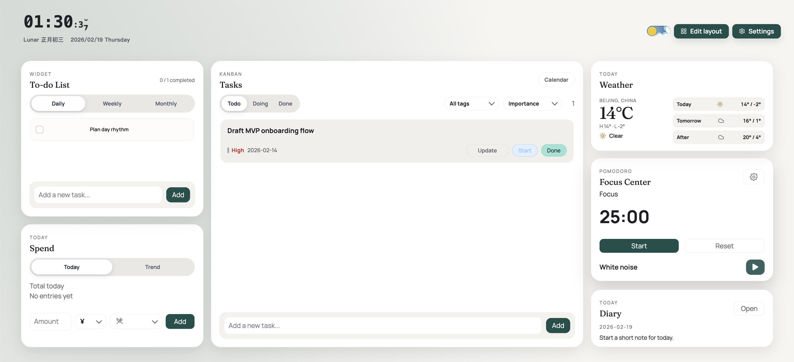

# Focus&go

[](https://github.com/VelvetAbyss/Focus-Go/actions/workflows/verify.yml)
[](https://github.com/VelvetAbyss/Focus-Go/actions/workflows/release-unsigned.yml)
[](./LICENSE)
[](https://github.com/VelvetAbyss/Focus-Go/releases)

All-in-one personal productivity workspace that reduces context switching across planning, focus, reflection, and daily signals.

[](https://focus-go.vercel.app)
[](https://github.com/VelvetAbyss/Focus-Go/releases)
[](#quick-start)

## Why Focus&go

Most productivity setups are fragmented: tasks in one app, timer in another, notes somewhere else, and no single view of progress.  
Focus&go brings them together so individuals can plan, execute, and review in one continuous workflow.

## Core Features

- Unified dashboard with configurable widgets for everyday planning and execution.
- Task management with status flow, subtasks, due date, priorities, tags, and activity history.
- Focus Center with Pomodoro timer, break rhythm, and white-noise controls.
- Daily diary entry panel to capture progress, outcomes, and reflection.
- Spend tracking widgets for quick personal finance awareness.
- Weather widget and city controls to keep daily context visible.
- Persistent local-first data behavior with cloud sync hooks for layout state.
- Web and desktop app delivery in a single monorepo.

## Product Preview



## Quick Start

### Prerequisites

- Node.js 20+ (Node.js 22 recommended)
- npm 10+

### Run Web App

```bash
npm install
npm run dev:web
```

### Run Desktop App

```bash
npm install
npm run dev:desktop
```

### Verify

```bash
npm run verify
```

## Roadmap and Changelog

- Roadmap: [Planned improvements](https://github.com/VelvetAbyss/Focus-Go/issues?q=is%3Aissue%20is%3Aopen%20label%3Aenhancement)
- Changelog: [Releases](https://github.com/VelvetAbyss/Focus-Go/releases)

## Releases

Focus&go uses a dual-track release model:

- Stable releases for everyday use.
- Prereleases for early testing and feedback.

## Project Structure

```text
apps/
  web/        React + Vite web client
  desktop/    Electron desktop client
packages/
  core/       Shared domain models and interfaces
  db-contracts/ Shared database contracts and schemas
docs/
  README.md   Documentation index
```

## Documentation

- Docs index: [`docs/README.md`](./docs/README.md)
- OSS release backup: [`docs/oss-backup.md`](./docs/oss-backup.md)

## Contributing

Contributions are welcome and low-friction. Start with [`CONTRIBUTING.md`](./CONTRIBUTING.md) for bug reports, feature ideas, and pull requests.

## FAQ

### Is Focus&go web-only?

No. Focus&go provides both web and desktop experiences.

### Is this suitable for teams?

Current scope is individual productivity first. Team workflows are not the primary target yet.

### Are prereleases stable?

No. Prereleases are for evaluation and feedback and may include unfinished changes.

## License

This project is licensed under the [MIT License](./LICENSE).
