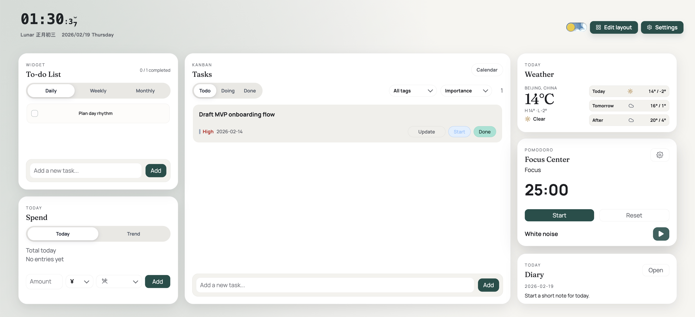

# Focus&go

[](https://github.com/VelvetAbyss/Focus-Go/actions/workflows/verify.yml)
[](https://github.com/VelvetAbyss/Focus-Go/actions/workflows/desktop-release.yml)
[](./LICENSE)
[](https://github.com/VelvetAbyss/Focus-Go/releases)

All-in-one personal productivity workspace that reduces context switching across planning, focus, reflection, and daily signals.

[](https://focus-go.vercel.app)
[](https://github.com/VelvetAbyss/Focus-Go/releases)
[](#quick-start)

## Why Focus&go

Most productivity setups are fragmented: tasks in one app, timer in another, notes somewhere else, and no single view of progress.  
Focus&go brings them together so individuals can plan, execute, and review in one continuous workflow.

## Free and open source

Every current product feature is free under the MIT license. Local use never requires an account. Signing in enables the optional official cloud-sync service, which includes **250 MiB per account** by default; self-hosted deployments control their own limits.

Past paid users are recognised as early supporters. Optional GitHub Sponsors, PayPal, and Z-Pay links never unlock features or change account access.

## Desktop app

Download the macOS `.dmg` or Windows `-setup.exe` from the
[releases page](https://github.com/VelvetAbyss/Focus-Go/releases). Builds are
not code-signed yet, so the first launch needs one extra step: on macOS right-click the
app → **Open**, and on Windows click **More info** → **Run anyway** past SmartScreen.

On first launch the app asks where your data should live:

- **Local only** — no account, nothing leaves your machine, works fully offline.
- **Cloud sync** — sign in and the same workspace follows you across devices.

Either choice is reversible in **Settings → Data → Storage mode**; both write to the
device first, and cloud sync only adds a server copy on top.

## Core Features

- Unified dashboard with configurable widgets for everyday planning and execution.
- Task management with status flow, subtasks, due date, priorities, tags, and activity history.
- Focus Center with Pomodoro timer, break rhythm, and white-noise controls.
- Daily diary entry panel to capture progress, outcomes, and reflection.
- Spend tracking widgets for quick personal finance awareness.
- Weather widget and city controls to keep daily context visible.
- Local-first data that works with no account at all, plus optional authenticated cloud sync.
- Web client, macOS/Windows desktop app, and self-hostable API source.

## Product Preview



## Quick Start

### Prerequisites

- Node.js 20+ (Node.js 22 recommended)
- npm 10+

### Run Web App

```bash
npm install
npm run dev:web
```

### Run the API locally

```bash
cp apps/web/focus-go-api/.env.example apps/web/focus-go-api/.env
npm --workspace focus-go-api start
```

Configure `VITE_API_BASE` in `apps/web/.env.local` when the Web app should use a non-default API URL. Never commit `.env` files or real credentials.

### Verify

```bash
npm run verify
```

## Roadmap and Changelog

- Roadmap: [Planned improvements](https://github.com/VelvetAbyss/Focus-Go/issues?q=is%3Aissue%20is%3Aopen%20label%3Aenhancement)
- Changelog: [Releases](https://github.com/VelvetAbyss/Focus-Go/releases)

## Releases

Focus&go uses a dual-track release model:

- Stable releases for everyday use.
- Prereleases for early testing and feedback.

Version numbers follow the project rules in [VERSIONING.md](./VERSIONING.md).

## Project Structure

```text
apps/
  web/                    React + Vite web client
  web/focus-go-api/       Node/Express API
packages/
  core/       Shared domain models and interfaces
  db-contracts/ Shared database contracts and schemas
docs/
  README.md   Documentation index
```

## Documentation

- API configuration: [`apps/web/focus-go-api/.env.example`](./apps/web/focus-go-api/.env.example)
- Security reporting: [`SECURITY.md`](./SECURITY.md)
- Support links: [`SUPPORT.md`](./SUPPORT.md)

## Self-hosting and third-party materials

Deploy the Web client and API with your own environment values. The public API configuration is documented in [`apps/web/focus-go-api/.env.example`](./apps/web/focus-go-api/.env.example); configure your own authentication, storage, and allowed origins before exposing an instance.

The repository's own code is MIT-licensed. Third-party npm packages, self-hosted fonts, images, and external APIs keep their respective licenses and terms. Do not assume that the MIT license grants rights to third-party assets, hosted services, or API data; review each dependency and provider before redistribution or production use.

## Contributing

Contributions are welcome. Read [`CONTRIBUTING.md`](./CONTRIBUTING.md), [`CODE_OF_CONDUCT.md`](./CODE_OF_CONDUCT.md), and [`SECURITY.md`](./SECURITY.md) before opening an issue or pull request.

## FAQ

### Is the desktop source included?

Not in this release. This public repository contains the Web application and API only; it does not claim to publish the local-only desktop source.

### Is this suitable for teams?

Current scope is individual productivity first. Team workflows are not the primary target yet.

### Are prereleases stable?

No. Prereleases are for evaluation and feedback and may include unfinished changes.

## License

This project is licensed under the [MIT License](./LICENSE).
