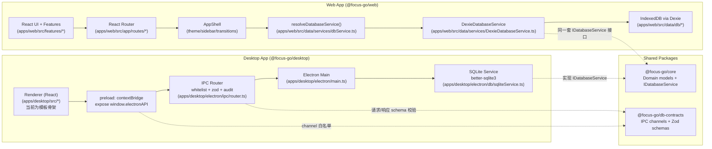

# Focus&go 项目总览（LLM 一次性理解版）

> 目标：把本文件整段发送给 Gemini / Claude / ChatGPT 等模型，即可在**不打开仓库**的情况下，快速理解 Focus&go 的产品形态、仓库结构、技术栈、核心模块、数据层与运行方式。

- 生成日期：2026-03-16
- 参考 Git 版本：`6ebbeb9`（注意：本地工作区可能存在未提交改动）

---

## 1. 项目是什么

Focus&go 是一个「个人效率工作台」：把规划（任务/待办/日历）、专注（番茄钟/白噪音）、复盘（日记/回顾）和日常信号（天气/支出等）整合在一个连续工作流中，减少在多应用之间的上下文切换。

当前仓库定位为一个 **Monorepo**，同时承载：

- Web 客户端（主要产品形态，Vite + React）
- Desktop 客户端（Electron，包含主进程 + 本地 SQLite + IPC 协议；渲染层目前仍是模板骨架，见后文“当前实现状态”）
- 共享包：领域模型、数据库服务接口、IPC 合约与 Zod 校验
- 发布/验证/备份脚本（含 OSS 备份工作流）

---

## 2. 技术栈与语言

### 2.1 主要语言

- TypeScript：核心业务与 UI（`apps/web`、`apps/desktop`、`packages/*`）
- JavaScript（Node ESM `.mjs`）：发布与备份脚本（`scripts/oss/*.mjs`）
- JSON / JSON5：配置（如 `vercel.json`、`apps/desktop/electron-builder.json5`）

### 2.2 前端（Web）

- React 19（`apps/web/package.json`）
- React Router（`react-router-dom`）
- Vite（构建/开发）
- Tailwind CSS + shadcn/ui（`apps/web/components.json`、`apps/web/src/components/ui/*`）
- Radix UI（无障碍基础组件）
- motion（页面过渡与动效）
- TipTap（富文本编辑；Notes/Task Note 等）
- Dexie（IndexedDB，本地优先数据层）
- Vitest + Testing Library（测试）
- ESLint（静态检查）

### 2.3 桌面端（Desktop）

- Electron（主进程 + preload + 渲染层）
- better-sqlite3（本地 SQLite）
- electron-builder（打包发布）
- electron-updater（自动更新）

### 2.4 共享包（Packages）

- `packages/core`：领域模型、`IDatabaseService` 接口、生态适配器接口等
- `packages/db-contracts`：IPC 通道白名单 + Zod 请求/响应 schema（用于 Electron IPC 的“合约层”）

---

## 3. 仓库结构（一眼定位）

```text
/
  apps/
    web/                   Web 客户端（React + Vite）
    desktop/               Desktop 客户端（Electron + Vite）
    rss-resolver-worker/   RSS 解析 Worker（当前目录为空壳/缓存文件为主）
  packages/
    core/                  领域模型 + IDatabaseService
    db-contracts/          IPC 通道 + Zod schemas（请求/响应合约）
  docs/                    文档与 SOP（含 OSS 备份说明）
  scripts/oss/             发布工件打包/上传/校验/恢复脚本
  package.json             Monorepo workspace + 顶层脚本入口
  vercel.json              Web 部署到 Vercel 的构建配置
  tsconfig.base.json       TypeScript 基础配置
```

### 3.1 关键入口文件（LLM 快速跳转索引）

**Web：**

- 应用入口：`apps/web/src/main.tsx`
- 根组件：`apps/web/src/App.tsx`
- 路由表：`apps/web/src/app/routes/routes.ts`
- 路由装配：`apps/web/src/app/routes/AppRoutes.tsx`
- AppShell（侧边栏/主题/页面过渡）：`apps/web/src/app/layout/AppShell.tsx`
- 数据层选择器（Dexie vs IPC）：`apps/web/src/data/services/dbService.ts`
- Dexie 实现：`apps/web/src/data/services/DexieDatabaseService.ts`
- Dexie schema：`apps/web/src/data/db/schema.ts`

**Desktop：**

- 主进程入口：`apps/desktop/electron/main.ts`
- preload（向 renderer 暴露 `window.electronAPI`）：`apps/desktop/electron/preload.ts`
- IPC 路由（白名单 + Zod 校验 + 审计）：`apps/desktop/electron/ipc/router.ts`
- SQLite 实现（better-sqlite3）：`apps/desktop/electron/db/sqliteService.ts`
- 安全策略（禁导航/隔离等）：`apps/desktop/electron/security/windowSecurity.ts`
- 自动更新：`apps/desktop/electron/updater/autoUpdater.ts`

**共享包：**

- DB 服务接口：`packages/core/src/database/IDatabaseService.ts`
- IPC 通道白名单：`packages/db-contracts/src/channels.ts`
- IPC Zod schemas：`packages/db-contracts/src/schemas.ts`

---

## 4. 架构总览（文字 + Mermaid）

### 4.1 总体分层

从“业务代码组织”的角度，整体可视作四层：

1. **UI / Feature 层（Web 为主）**：按业务模块拆分的页面与组件（`apps/web/src/features/*`）
2. **App Shell 层**：导航、主题、动效、全局 Provider（`apps/web/src/app/*`）
3. **Domain/Contract 层（共享）**：
   - `packages/core` 提供领域模型与数据库服务接口（`IDatabaseService`）
   - `packages/db-contracts` 定义 IPC 合约（通道白名单 + Zod schema）
4. **Data/Storage 层**：
   - Web：Dexie（IndexedDB）本地优先
   - Desktop：SQLite（better-sqlite3）+ Electron IPC（主进程持有数据库能力）

### 4.2 架构图（核心数据路径）



---

## 5. 当前实现状态（非常重要：准确描述“现在”）

### 5.1 Web（已具备完整产品面）

Web 端包含完整的 AppShell、路由体系、Feature 模块、Dexie 数据层、i18n/主题/动效等，是目前项目的主要落地形态。

### 5.2 Desktop（主进程与数据层完整，渲染层仍是模板）

Desktop 端 Electron **主进程**已经具备：

- 安全窗口选项（`contextIsolation: true`、`sandbox: true`、禁 `window.open` 等）
- 基于白名单 + Zod 的 IPC Router（请求/响应 schema 校验 + 审计日志）
- SQLite 数据服务（better-sqlite3）
- 文件选择/读取 guard（只允许读取用户选择过的路径）
- Dexie JSON 导入到 SQLite 的导入入口（`db:importDexieJsonFromFile`）
- 自动更新埋点与触发（electron-updater）

但 **渲染层**（`apps/desktop/src/App.tsx`）目前仍是 Vite + React 模板示例页面，并未嵌入 Web 端的完整 UI/Feature。也就是说：Desktop 目前更像一个“具备数据后端能力的壳”，UI 集成仍待推进。

### 5.3 rss-resolver-worker

`apps/rss-resolver-worker/` 当前仅保留目录结构（`src/` 为空），可视作未来 Worker 的占位；仓库中存在 `/.wrangler` 缓存文件不代表业务实现已就绪。

---

## 6. 功能总览（按页面 / 模块组织）

> Web 路由与页面装配：`apps/web/src/app/routes/AppRoutes.tsx`  
> 路由常量：`apps/web/src/app/routes/routes.ts`

### 6.1 Dashboard（`/`）

- 目标：一个可配置的“每日工作台”，聚合常用卡片/小组件。
- 入口页面：`apps/web/src/features/dashboard/DashboardPage.tsx`
- 卡片注册表：`apps/web/src/features/dashboard/registry.tsx`
- 已实现卡片（可从 registry 反推）：
  - 今日/周期 Todo（WidgetTodos）
  - 天气（Weather）
  - 日记入口（Diary Launcher）
  - 支出概览（Spend）
- 布局形态：使用 `react-grid-layout` 做卡片网格与拖拽布局；布局持久化走 DB（Dexie/SQLite）。

### 6.2 Tasks（`/tasks`）

主要能力（从数据模型与 UI 代码推断）：

- 任务状态流转：`todo / doing / done`
- 优先级：`high / medium / low`（可为空）
- 日期字段：`dueDate / startDate / endDate`
- 置顶：`pinned`
- 标签：`tags[]`
- 子任务：`subtasks[]`
- 进度日志：`progressLogs[]`
- 活动日志：`activityLogs[]`（状态/进度/详情类）
- 任务备注（Task Note）：支持富文本（JSON）与 Markdown（双表示）
- 提醒：`reminderAt` + `reminderFiredAt`（并有提醒引擎 `useTaskReminderEngine` 在 AppShell 中启动）

关键文件：

- 页面：`apps/web/src/features/tasks/pages/TasksPage.tsx`
- 主视图：`apps/web/src/features/tasks/TasksBoard.tsx`
- 任务抽屉：`apps/web/src/features/tasks/TaskDrawer.tsx`
- 任务备注编辑器：`apps/web/src/features/tasks/components/TaskNoteEditor.tsx`
- Task Note 模型：`apps/web/src/features/tasks/model/taskNote.ts`、`apps/web/src/features/tasks/model/taskNoteRichText.ts`

### 6.3 Note（`/note`）

目标：独立的笔记工作区（支持标签/外观设置/回收站等），并具备统计信息（字数、段落、标题提取、回链等）。

关键文件：

- 页面：`apps/web/src/features/notes/pages/NotePage.tsx`
- 笔记浏览器/侧栏：`apps/web/src/features/notes/components/NoteBrowser.tsx`、`apps/web/src/features/notes/components/NoteSidebar.tsx`
- 编辑器：`apps/web/src/features/notes/components/NoteEditor.tsx`
- 外观设置（主题/字体/宽度/专注模式等）：`apps/web/src/features/notes/components/AppearanceModal.tsx`
- 导出：`apps/web/src/features/notes/components/ExportModal.tsx`
- 回收站：`apps/web/src/features/notes/components/TrashModal.tsx`
- 富文本 codec/extensions：`apps/web/src/features/notes/model/richTextCodec.ts`、`apps/web/src/features/notes/model/richTextExtensions.ts`
- 标签模型：`apps/web/src/features/notes/model/tags.ts`

数据侧（Dexie 实现中可以看到）：

- `NoteItem` 具备 `contentMd` + 可选 `contentJson`（富文本结构）
- 自动统计字段：`wordCount/charCount/paragraphCount/imageCount/fileCount/headings/backlinks`
- 删除模型：`deletedAt` 软删除 + Trash 列表 + restore/hardDelete
- Appearance：`note_appearance` 单例记录（theme/font/fontSize/lineHeight/contentWidth/focusMode）

### 6.4 Calendar（`/calendar`）

- 入口页面：`apps/web/src/features/calendar/pages/CalendarPage.tsx`
- 说明：当前 Calendar 模块作为独立页面存在，常用于聚合日期维度的信息（与任务日期、日记日期等产生联动的可能性较高）。

### 6.5 Focus（`/focus`）

目标：专注中心（番茄/计时、节奏控制、白噪音、可视化、历史记录）。

关键文件：

- 页面：`apps/web/src/features/focus/pages/FocusPage.tsx`
- 噪音与共享音频：`apps/web/src/features/focus/noise.ts`、`apps/web/src/features/focus/SharedNoiseProvider.tsx`
- 可视化：`apps/web/src/features/focus/components/NoiseVisualizerBars.tsx`

数据侧：

- `focusSettings`：focus/break/longBreak 时长、noise 轨道设置等
- `focusSessions`：支持 `start` / `complete`，记录 planned/actual、状态、完成时间等

### 6.6 Review（日记回顾）（`/review`）

目标：日记记录与回顾面板（按日期范围、历史、回收站/过期等）。

关键文件：

- 页面：`apps/web/src/features/diary/pages/ReviewPage.tsx`
- Review deck：`apps/web/src/features/diary/review/ReviewDeck.tsx`
- 历史面板：`apps/web/src/features/diary/review/ReviewHistoryPanel.tsx`
- Diary bridge：`apps/web/src/features/diary/review/reviewDiaryBridge.ts`

数据侧：

- `diaryEntries`：以 `dateKey` 作为核心索引（`YYYY-MM-DD`）
- 删除/过期：`deletedAt`、`expiredAt`，并提供 `markExpiredOlderThan()`、trash list、restore、hard delete 等能力

### 6.7 Settings（`/workspace/settings`）

- 入口：`apps/web/src/app/routes/SettingsRoute.tsx`
- 范围：偏好设置、主题、实验室功能入口等（具体可从页面组件继续下钻）。

### 6.8 Labs（`/labs`）与 Feature Gate（含“会员/订阅”模拟）

目标：把一些“实验性/付费能力”做成可安装/可移除的功能模块（Feature Installation）。

关键文件：

- 页面：`apps/web/src/features/labs/pages/LabsPage.tsx`
- 逻辑：`apps/web/src/features/labs/labsApi.ts`、`apps/web/src/features/labs/labsModel.*`
- Provider：`apps/web/src/features/labs/LabsContext.tsx`

当前 catalog（以代码为准）：

- `ai-digest`（coming soon）
- `automation`（coming soon）
- `habit-tracker`（可用，但 premiumOnly）

数据侧：

- `userSubscriptions`：`tier: free | premium`（目前是本地 mock/种子数据）
- `featureInstallations`：记录功能安装/移除/恢复状态与时间戳

### 6.9 Habits（`/habits`，受 Labs gate 控制）

目标：习惯追踪页（streak、热力图、进度等）。

关键文件：

- 页面：`apps/web/src/features/habits/pages/HabitTrackerPage.tsx`
- Hook：`apps/web/src/features/habits/hooks/useHabitTracker.ts`
- 组件：`apps/web/src/features/habits/components/*`
- 数据 schema：`apps/web/src/features/habits/model/habitSchema.ts`

注意（跨端差异）：

- Web 的 Dexie DB schema 包含 `habits` / `habit_logs`
- Desktop 的 `IPCDatabaseService` 中，Habits 相关接口目前显式抛出 “not implemented yet”（`apps/web/src/data/services/IPCDatabaseService.ts`）

---

## 7. 数据与存储（核心：IDatabaseService + 双实现）

### 7.1 统一的数据库服务接口（Domain 层）

核心接口：`packages/core/src/database/IDatabaseService.ts`

它把应用需要的存储能力抽象为几个子域：

- `tasks`
- `notes`
- `noteTags`
- `noteAppearance`
- `widgetTodos`
- `focus`
- `focusSessions`
- `diary`
- `spend`
- `dashboard`
- `habits`

UI/业务层**不直接依赖 Dexie 或 SQLite**，而是依赖 `IDatabaseService`，从而支持：

- Web 直接走 Dexie（IndexedDB）
- Desktop 通过 preload 暴露的 `window.electronAPI` 走 IPC，再由主进程落 SQLite

### 7.2 Web：Dexie（IndexedDB）实现

- 选择入口：`apps/web/src/data/services/dbService.ts`
- Dexie 实现：`apps/web/src/data/services/DexieDatabaseService.ts`
- Schema：`apps/web/src/data/db/schema.ts`
  - `DB_NAME = workbench-app`
  - `DB_VERSION = 25`
  - tables 覆盖 tasks / notes / spend / diary / focus / dashboard / habits / labs 等

仓库中以 `apps/web/src/data/repositories/*` 的方式做 repo 封装（更利于测试与跨实现替换）。

### 7.3 Desktop：SQLite + IPC 合约实现

#### 7.3.1 preload 暴露的浏览器端 API（Renderer → Main）

Desktop 的 Renderer 侧通过 preload 注入 `window.electronAPI`（`apps/desktop/electron/preload.ts`），目前暴露的能力包括：

- `invokeDb(channel, payload)`：调用数据库相关 IPC（**带通道白名单校验**）
- `selectImportFile()` / `readImportFile(filePath)`：导入文件选择 + 读取（受文件访问 guard 保护）
- `importDexieJsonFromFile(filePath)`：把 Dexie 导出的 JSON 数据导入 SQLite

> 注：出于安全考虑，preload 会先对 IPC channel 做白名单校验（来自 `@focus-go/db-contracts`）。

#### 7.3.2 IPC Router：白名单 + Zod 请求/响应校验 + 审计日志

IPC Router 实现位于 `apps/desktop/electron/ipc/router.ts`，核心点：

- **只允许白名单通道**：通道列表来自 `packages/db-contracts/src/channels.ts`
- **请求校验**：`ipcRequestSchemas[channel].safeParse(payload)`
- **响应校验**：handler 返回后，会用 `ipcResponseSchemas[channel]` 再校验一次
- **统一错误结构**：`{ ok: false, error: { code, message } }`
- **审计日志**：成功/失败都会落日志（channel、ok、errorCode）

这套“合约层”让 Desktop 的 Renderer/Main 之间变成可验证、可演进的协议，而不是散落的 `ipcMain.handle()`。

#### 7.3.3 SQLite Service：better-sqlite3 的本地存储实现

SQLite 相关实现位于 `apps/desktop/electron/db/sqliteService.ts`，特点：

- 更贴近“生产级本地存储”：SQLite 文件位于用户数据目录（`app.getPath('userData')` 下）
- 以 `@focus-go/core` 的模型类型为准（Task/Note/Diary/Spend/Focus/Dashboard 等）
- 用 JSON 序列化字段承载复杂结构（tags/subtasks/富文本 JSON/日志数组等）
- 具备 Dexie JSON → SQLite 的导入流程（与 `db:importDexieJsonFromFile` 组合）

> 现状差异：Habits 在 Desktop 的 IPCDatabaseService 侧尚未实现（会抛错），因此习惯追踪目前更偏 Web 端“可用能力”。

---

## 8. UI 框架与横切能力（主题 / i18n / 动效 / 偏好）

### 8.1 主题（Theme）

- 主题应用与初始化：`apps/web/src/shared/theme/theme.ts`
- token：`apps/web/src/shared/theme/tokens.css`
- theme pack（模式切换前事件等）：`apps/web/src/shared/theme/themePack.ts`
- UI 层触发：`apps/web/src/app/layout/AppShell.tsx` 内 `toggleTheme()`

### 8.2 偏好（Preferences）

- Provider：`apps/web/src/shared/prefs/PreferencesProvider.tsx`
- hook：`apps/web/src/shared/prefs/usePreferences.ts`
- 示例：AppShell 会读取 `uiAnimationsEnabled`，决定是否启用页面过渡动画。

### 8.3 i18n

- 入口：`apps/web/src/shared/i18n/*`
- 文案资源：`apps/web/src/shared/i18n/messages/zh.ts`、`apps/web/src/shared/i18n/messages/en.ts`

### 8.4 动效（Motion / Page transitions）

- 页面过渡 variants/timing：`apps/web/src/shared/ui/transitions.ts`
- 触发点：`apps/web/src/app/layout/AppShell.tsx` 使用 `AnimatePresence + motion.section`

---

## 9. 构建、运行与验证（最小步骤）

> 以下命令以 **npm workspace** 方式运行（仓库包含 `package-lock.json`，默认使用 npm）。

### 9.1 环境要求

- Node.js 20+（README 推荐 22）
- npm 10+

### 9.2 安装依赖

```bash
npm install
```

### 9.3 运行 Web（开发）

```bash
npm run dev:web
```

对应脚本：根 `package.json` → `dev:web` → workspace `@focus-go/web` 的 `vite`。

### 9.4 运行 Desktop（开发）

```bash
npm run dev:desktop
```

对应脚本：根 `package.json` → `dev:desktop` → workspace `@focus-go/desktop` 的 `vite`（集成 `vite-plugin-electron` 启动主进程 + preload + renderer）。

### 9.5 一键验证（lint + build）

```bash
npm run verify
```

它会执行：

- `npm run lint:web`
- `npm run build:web`
- `npm run build:desktop`

> 如果你需要更细粒度：各 workspace 内也各自有 `test` / `lint` / `build`。

---

## 10. 部署与发布

### 10.1 Web：Vercel

Vercel 配置位于 `vercel.json`：

- install：`npm ci`
- build：`npm run build:web`
- output：`apps/web/dist`
- dev：`npm run dev:web`

### 10.2 Desktop：electron-builder + GitHub Releases

Desktop 打包配置：`apps/desktop/electron-builder.json5`

特点：

- `asar: true`
- 输出目录：`apps/desktop/release/${version}`
- 发布 provider：GitHub（repo/owner 由环境变量提供）
- mac：dmg + hardenedRuntime
- win：NSIS（非 oneClick，可改安装目录）

Desktop 自动更新：`apps/desktop/electron/updater/autoUpdater.ts`（基于 `electron-updater`）。

---

## 11. OSS 工件备份（发布资产长期保存）

仓库内提供了一套“把 release 工件备份到 OSS（阿里云对象存储）”的脚本与工作流：

- 说明文档：`docs/oss-backup.md`
- 脚本：`scripts/oss/*.mjs`
- 工作流：`.github/workflows/oss-release-backup.yml`、`.github/workflows/oss-restore-drill.yml`

本地运行需要的环境变量示例在 `.env.example`（注意：这只是占位示例，真实密钥请用 CI Secrets 或本地安全注入）：

```bash
OSS_BUCKET=<your-bucket>
OSS_ENDPOINT=<your-oss-endpoint>
OSS_ACCESS_KEY_ID=<your-access-key-id>
OSS_ACCESS_KEY_SECRET=<your-access-key-secret>
```

---

## 12. 测试体系（你可以从这里判断“模块是否可用”）

### 12.1 Web 测试

- 测试框架：Vitest
- 典型测试位置：
  - 路由：`apps/web/src/app/routes/*.test.tsx`
  - Dashboard：`apps/web/src/features/dashboard/*test*`
  - Tasks/Habits/Diary/等：对应 `features/*` 下的 `*.test.tsx`
  - DB Service：`apps/web/src/data/services/*test*`

运行（示例）：

```bash
npm run test --workspace @focus-go/web
```

### 12.2 Desktop 测试

测试位置：`apps/desktop/tests/*`

覆盖面（从文件名可粗略判断）：

- windowSecurity / accessGuard / ipc router / sqliteService / autoUpdater 等

运行（示例）：

```bash
npm run test --workspace @focus-go/desktop
```

---

## 13. “给 LLM 快速理解项目”建议的阅读顺序（可直接照着下钻）

1. 产品与 Quick Start：`README.md`
2. Web 路由与 Shell：`apps/web/src/App.tsx` → `apps/web/src/app/layout/AppShell.tsx` → `apps/web/src/app/routes/AppRoutes.tsx`
3. 重要 Feature 页面（按路由）：
   - Dashboard：`apps/web/src/features/dashboard/DashboardPage.tsx`
   - Tasks：`apps/web/src/features/tasks/pages/TasksPage.tsx`
   - Note：`apps/web/src/features/notes/pages/NotePage.tsx`
   - Focus：`apps/web/src/features/focus/pages/FocusPage.tsx`
   - Review：`apps/web/src/features/diary/pages/ReviewPage.tsx`
   - Labs/Habits：`apps/web/src/features/labs/pages/LabsPage.tsx`、`apps/web/src/features/habits/pages/HabitTrackerPage.tsx`
4. 数据层抽象与实现：
   - `packages/core/src/database/IDatabaseService.ts`
   - `apps/web/src/data/services/dbService.ts`
   - `apps/web/src/data/services/DexieDatabaseService.ts`
5. Desktop 的“合约与存储”：
   - `packages/db-contracts/src/channels.ts` + `packages/db-contracts/src/schemas.ts`
   - `apps/desktop/electron/ipc/router.ts`
   - `apps/desktop/electron/db/sqliteService.ts`

---

## 14. 附录：常用 npm 脚本索引（顶层）

来自根 `package.json`：

- `npm run dev:web`：启动 Web
- `npm run dev:desktop`：启动 Desktop（Electron + Vite）
- `npm run build:web` / `npm run build:desktop`
- `npm run lint:web` / `npm run lint:desktop`
- `npm run verify`：lint+build 汇总
- `npm run release:oss:publish`：发布工件到 OSS（需要配置环境变量/CI secrets）
